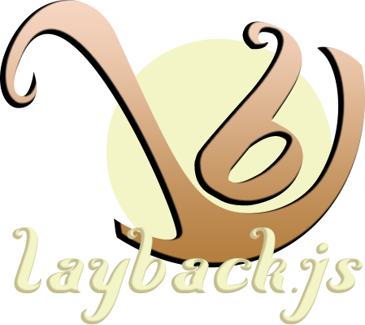

class: center, middle

# What is the eternal force that drives us to invent?

---

class: center, middle


# Lazyness

---

class: center, middle



---

class: center, top

# Problems in everyday work

I should be able to somehow pass settings to my object...

Reaching the dom objects would be nice...

I should be able to use callbacks...

I can make it as a jQuery plugin with some extra work...

I have items inside...

Oh, it should work a different way on mobile...

---

class: center, top

# Wait, haven't I already done these things before?

--


## Yes I did

---

class: center, middle

# Introduction to layback
## What it comes with

---

class: left, middle

### Accessing data:
* Setting Data namespaces
* Setting defaults to each data namespace
* Automatic data overriding with user data
* set, get functions for accessing the data inside the **data** namespace
* setters, getters. E.g. `this.setFoo('dummy')`, `this.getFoo()`. (optional feature)

---

class: left, middle

### Accessing DOM elements:
* You can add selectors/HTML elements/jQuery objects to the **dom** namespace
* It uses the same fallback as mentioned above (defaults > user)
* Using *Element shortcuts from user data. E.g. `{someElement: '.some-element'}`
* You can simple create a jQuery plugin from your object (optional feature)
* Overriding data from element data (only if you use you object as a plugin)

---

class: left, middle

### Observers:
* It uses the **callbacks** data namespace, so it uses the same kind of fallback
* dispatching events: E.g. `this.dispatch('some-event', eventData)`
* observing events: E.g. `obj.observe('some-event', myCallbackFunction)`
* Automatically handles the on* user data. E.g `{onSomeEvent: myCallbackFunction}`

---

class: left, middle

### Collection (optional):
* You can set objects or jQuery object as items
* You can use all the usual things a collection can do
1. add / remove items
2. iterate through
3. slice / grep
* On top of these, you can also use it as a pager, by setting a pager size and getting the page.

---

class: left, middle

### Responsive (optional)
* You can set breakpoints
* You can change any kind of data when the breakpoint changes
* You can assign responder functions to beakpoint changes

---

class: center, middle

# But most importantly you can write your own set of features, and you can enpower your Objets with them

---

class: top, left

# Using layback

--

### 1. Create a javascript Function object
```javascript
var Creature = function(properties) {
    // Do stuff here
}
```

--

### 2. Make it use layback
```javascript
var Creature = function(properties) {
    this.layback(properties);
    // Do stuff here
}

layback(Creature).make();
```
---

# Example for data handling

```javascript
layback('Creature', function(properties) {
  // ...
    this.layback(properties);
    // ...
})
.defaults({ // Set default data
    data: { // This is a data namespace
        hunger: 0,
        stamina: 100
    }
})
.make();

var creature = new Creature({stamina: 50});
creature.get('hunger'); // 0
creature.get('stamina'); // 50
```

---

# Adding extra freatures (treats)

```javascript
layback(Creature)
.defaults({
    data: {
        hunger: 0,
        stamina: 100
    }
})
.use('setget')
.make();

var creature = new Creature();
creature.getHunger(); // 0
creature.setStamina(99);
creature.getStamina(); // 99

```

---

# Using the DOM namespace

```javascript
layback(Creature)
.defaults({
    dom: {
        body: 'body',
        container: '.container'
    }
})
.make();

var creature = new Creature({
  containerElement: '.my-container'
});
creature.dom('body'); // $('body')
creature.dom('container'); // $('.my-container')
```

---

# Using observers

```javascript
layback(Creature)
.defaults({
    callbacks: {
        someEvent: function(obj) {
          console.log(obj.get('blabla'))
      }
    }
})
.make();

var creature = new Creature({
  // Note the 'on' prepended to the camelised event name!
  onSomeOtherEvent: function(obj) {
      console.log('!!!')
  }
});

obj.observe('some-event', function(obj) {
  console.log(' blah');
});
obj.dispatch('some-event'); //> blabla > blah
obj.dispatch('some-other-event'); //> !!!
```

---

class: left,middle

# Using collections

```javascript
layback(Creature).use('collection').make();

var obj = new Creature;
// You can add Object, Array of Objects, jQuery objects here
obj.addCollectionItem($('.item'));
obj.getCollectionItems(); // the items
obj.getCollectionItemPosition($('.item')[2]); // 3
obj.removeCollectionItem($('.item')[1]); // removes the item
obj.getCollectionSize(); // collection length

obj.eachCollectionItems(function(i, item){
    $(item).addClass((i % 2) ? 'odd' : 'even');
}); // adding even and odd casses

obj.grepCollectionItems(function(item) {
  return !$(item).hasClass('even');
})); // get every second element

obj.sliceCollectionItems(30, 40, function(i, item){
    $(item).css('background', 'red');
}); // Set red bg to items 30..40

obj.setPagerLimit(10);
obj.getPageItems(2); // get elements 10..20 
```

---
class: left,middle

# Responsive features

```javascript
layback(Creature)
    .defaults({
        data: {
            renderWidth: 1000
        },
        breakpoints: {
            mobile: {
                width: 760, 
                data: {
                    renderWidth: 300
                }
            },
            tablet: {
                width: 980, 
                data: {
                    renderWidth: 900
                }
            }
        }
    })
    .use('respond')
    .make();
```
---

class: left, middle

```javascript
var obj = new Creature;
obj.respondTo('mobile', function(){
    console.log(
        this.getCurrentBreakpoint().name
        + ':' + this.get('renderWidth')
    );
});
obj.respondTo('tablet', function(){
    console.log(
        this.getCurrentBreakpoint().name
        + ':' + this.get('renderWidth')
    );
});
// below 760px> mobile:300, above 760px> tablet:900
```

---

class: center, middle

# Introduction to layback
## Write you own Treat

---

class: top, middle

### Example logger treat

```javascript
var MyLoggerTreat = function(classObject, tratData) {
  // Do You logic here ...
  layback(classObject)
      .addInitMethod(function(obj){
          obj.log('initialized');
      })
      .addMethod('log', function(text) {
          console.log(this, text);
      });
}
layback().treats().add(MyLoggerTreat, 'logger');
```
### Using it
```javascript
layback(Creature).use('logger').make();
var creature = new Creature; //> Creature {....}, initialized
```
---

class: center, middle

### If you like the idea
# Please contribute!


---

class: center, middle


### github: github.com/zsotyooo/layback.js
### docs: zsotyooo.github.io/layback.js